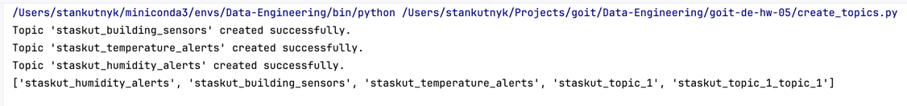
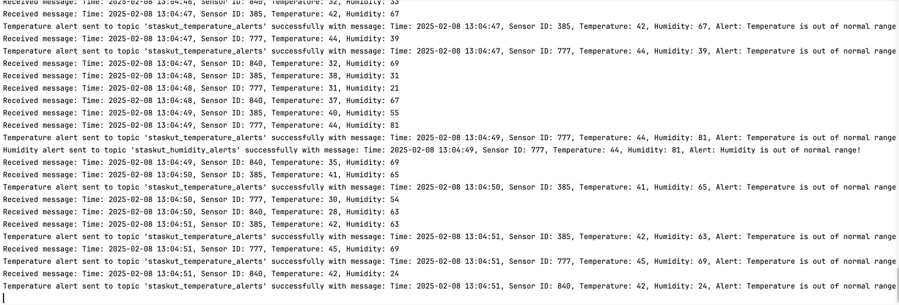
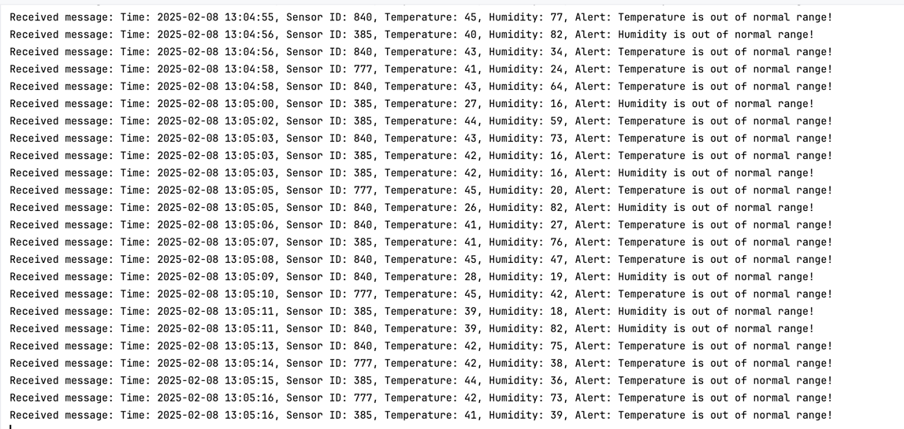

The script `create_topics.py` creates Kafka topics:

The script `run_sensor.py` initializes a sensor and sends data to the Kafka topic:

The script `read_measurements.py` reads data from the Kafka topic and sends alerts to the corresponding topics if required (temp>40 or hum>80 or hum<20):

The script `read_alerts.py` reads alerts from the Kafka topics:
